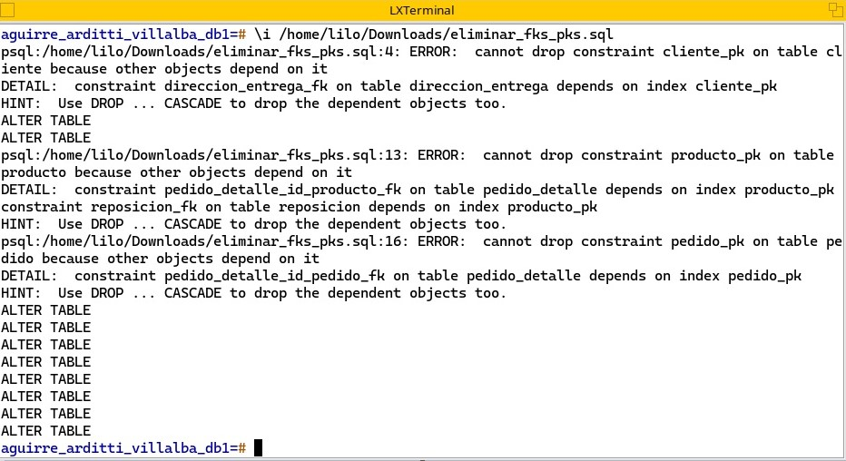
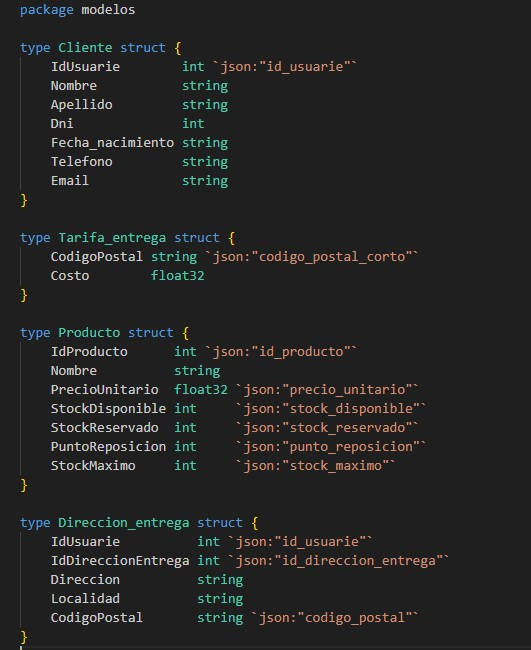

= Trabajo practico de Bases de Datos I: Chango Online
Aguirre Agustin <agustinaguirre3195@gmail.com>; Guillermo Arditti <guillermoarditti_97@hotmail.com>; Eduardo Villalba  <eduardovillalba39@gmail.com>
v1, {docdate} 
:toc: 
:toc-title: Contenidos 
:numbered: 
:source-highlighter: coderay 
:tabsize: 4 

El grupo se encuentra conformado por Aguirre Agustin, Arditti Guillermo, Villalba Eduardo con el fin de dar solucion en el trabajo practico de Bases de datos I en la Universidad Nacional de General Sarmiento.
Este informe documenta las distintas dificultades encontradas durante la construcción del Trabajo Práctico "Chango Online" y las soluciones implementadas para superarlas.

== Eliminar Primary Keys (PKs) y Foreign Keys (FKs)

Una de las consignas mantiene que debe ser posible ante una CLI eliminar las PKs y FKs, investigando notamos que es importante eliminar las FKs primero y luego las PKs ya que el sistema de gestion de bases de datos (DBMS) verifica la integridad referencial y asegura que no haya datos huerfanos en las tablas relacionadas. Si existen registros en otras tablas que hacen referencia a la clave primaria que estás tratando de eliminar, la DBMS no permitirá la eliminación de la clave primaria hasta que se resuelvan esos problemas.

.Error al eliminar PKs y FKs

Por tanto el orden importa.

Para crear: primero agregar pks y luego las fks.

Para eliminar: primero eliminar las fks y luego las pks.

== Mapear structs con JSON

Tambien tuvimos algunas dificultades para poder hacer el unmarshalling de los jsons que nos fueron dados para trabajar, ya que al generar los structs y proceder a hacer el unmarshalling, algunos campos de los jsons llegaban con valor 0.

Para solucionarlo, tuvimos que implementar algo parecido a la diapositiva N°42 de GO:

.Error al hacer unmarshalling

== Insertar datos en la tabla error

En cada consigna sobretodo relacionado a los Stored Producers, se deben realizar validaciones que deben contempletar que entre los argumentos existan una referencia en la base de datos, de no ser asi se debe registrar una fila en error. Es necesario insertar un id para el registro del error, para facilitar ese paso hicimos un cambio con la autorizacion del docente en la creacion de la tabla:

Antes:

[source, sql]
----
   create table error (
        id_error int
        --resto de columnas..
   ) 
----

Despues:

[source, sql]
----
  create table error (
      id_error serial
      --resto de columnas..
  ) 
----

De la misma manera, hemos modificado en la tabla _envio_email_ para facilitar la generacion de su respectiva _id_ en la automatizacion  enviar emails.

[source, sql]
----
   create table envio_email (
        id_email serial,
        --resto de columnas..
   ) 
----

== Transacciones

Contemplamos que luego de cada validacion en las consignas, pueden haber bloques de codigo que esten manipulando tablas y varios datos ya sea por _insert_, _update_, _delete_. Por ello consideramos pertinente configurar el nivel de transaccion en serializable en algunas partes del programa. Por ejemplo:

[source, sql]
----
begin

set transaction isolation level serializable;

update pedido
	set
		estado = 'cancelado'
	where
		id_pedido = id_pedido_aux;

	select id_producto,cantidad into productos_a_actualizar from pedido_detalle where id_pedido_aux=id_pedido;

	for producto_record in select * from productos_a_actualizar
		loop
		  update producto
			  set
          stock_disponible = stock_disponible + producto_record.cantidad,
          stock_reservado = stock_reservado - producto_record.cantidad
        where id_producto = producto_record.id_producto;
		end loop;

rollback;
return true;
commit;
end;
----

Podemos observar que existe manipulacion de datos sensibles como _stock_disponible_, _stock_reservado_, cambios de _estado_, que deben manejarse correctamente, por ello la configuracion de isolation level.

